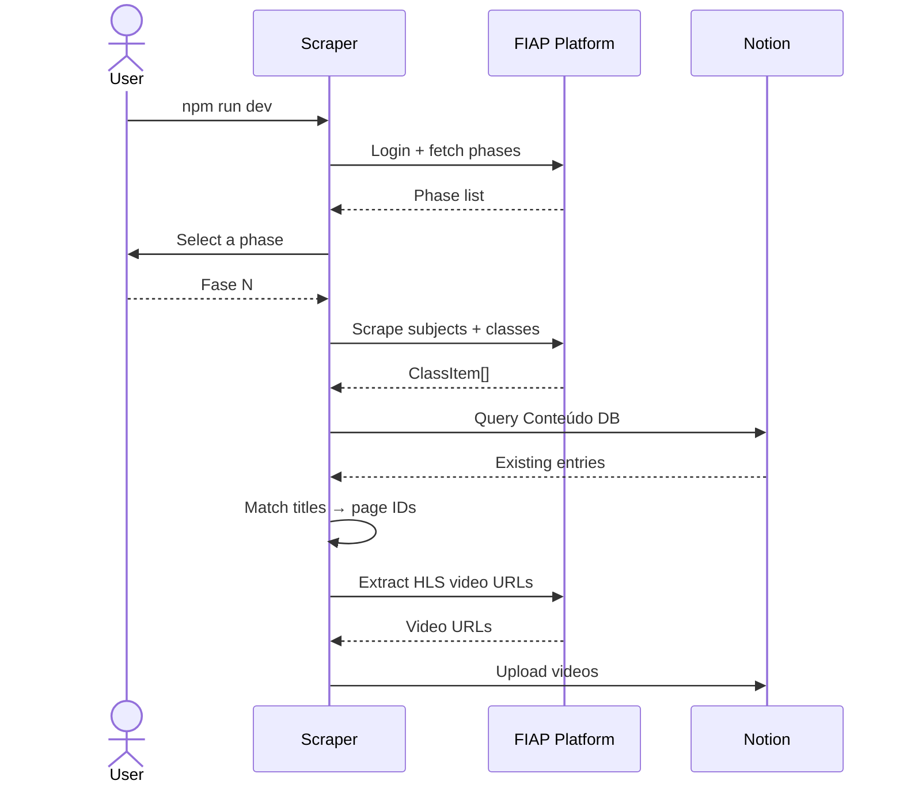
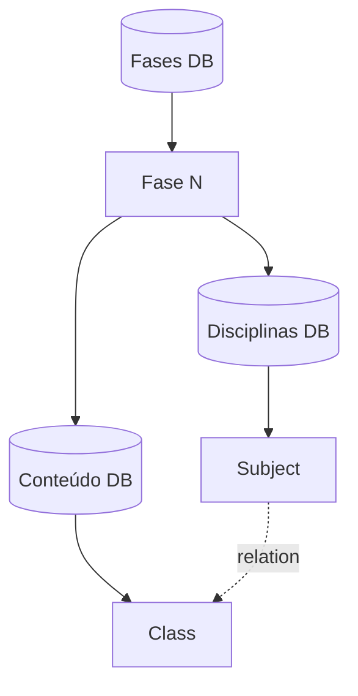

# FIAP to Notion Web Scraper

A work in progress... :hourglass_flowing_sand:

## Description

This project automates syncing study materials from my FIAP course into my personal Notion workspace. It scrapes the course platform and uploads video content to the corresponding Notion pages, keeping course content organized without manual effort.

The scraper will:

1. Authenticate on the FIAP course page.
2. Detect the active phase and extract its subjects and classes.
3. Match each class to its corresponding page in the Notion Conteúdo database.
4. Extract HLS video URLs for each class.
5. Upload the videos to Notion.

## How It Works



## Notion Workspace Structure

> **Note:** This project is tailored to a specific Notion workspace structure. The scraper expects the following hierarchy to exist before running — pages and databases are not created automatically.



Each **Fase** page contains two inline databases:
- **Disciplinas** — one row per subject, with a relation to Conteúdo
- **Conteúdo** — one row per class; this is what the scraper matches against and uploads to

## Technologies

- **[TypeScript](https://www.typescriptlang.org/)** — type-safe JavaScript
- **[Puppeteer](https://pptr.dev/)** — headless browser for scraping the FIAP course platform
- **[Notion SDK](https://github.com/makenotion/notion-sdk-js)** — querying and updating the Notion workspace
- **[@inquirer/prompts](https://github.com/SBoudrias/Inquirer.js)** — interactive CLI prompts
- **[ora](https://github.com/sindresorhus/ora)** — terminal spinners for async feedback

## Prerequisites

Make sure you have the following installed:

- **Node.js** (>= 24.x)
- **npm** (>= 11.x)

**Tip**: It is highly recommended to use **[nvm](https://github.com/nvm-sh/nvm)** (Node Version Manager) to manage and switch between different versions of Node.js easily.

## Installation

Clone the repository and install the dependencies:

```bash
git clone git@github.com:K-Schaeffer/fiap-to-notion.git
cd fiap-to-notion
nvm use # If you have nvm it will set the projects node version for you
npm install
cp .env.example .env
```

## Scripts

### `dev`

Runs the project in **development mode** (using `ts-node` to directly run TypeScript files without compilation).

### `build:start`

Compiles the TypeScript code and then starts the project (recommended for production).

### `build`

Compiles the TypeScript code into JavaScript.

### `start`

Starts the project after compilation.
