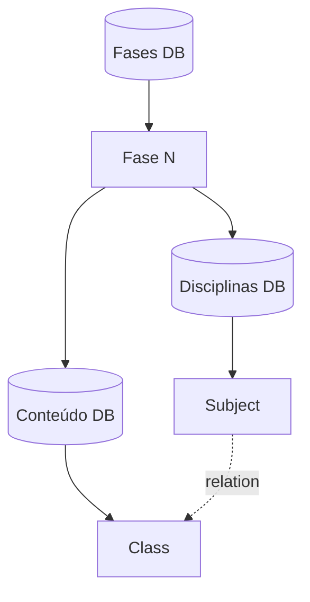

# FIAP to Notion

A work in progress... :hourglass_flowing_sand:

## Description

This project automates syncing study materials from my FIAP course into my personal Notion workspace. It has two modes:

**Scraper** — authenticates on the FIAP platform, extracts course structure (phases, subjects, classes), matches each class to its Notion page, and scrapes HLS video URLs.

**Video Converter** — downloads HLS video streams and converts them to MP4 files using ffmpeg. Fully offline — no browser or credentials needed, just the scraped data.

Both modes are fully resumable. Progress is persisted after every video/class, so interrupted runs pick up where they left off.

### Flow

1. Launch the CLI (`npm run dev`) and pick a mode: **Scraper** or **Video Converter**.
2. **Scraper**: authenticate → select a phase → sync subjects/classes to Notion → fetch HLS video URLs.
3. **Video Converter**: select a phase with fetched videos → download and convert all videos to MP4 in parallel.
4. _(Upcoming)_ Upload videos to Notion.

## How It Works

```mermaid
sequenceDiagram
    actor user as User
    participant cli as CLI
    participant state as data/output.json
    participant fiap as FIAP Platform
    participant notion as Notion
    participant ffmpeg as ffmpeg

    user->>cli: npm run dev
    cli->>user: Select mode

    rect rgb(40, 40, 60)
        Note over cli,notion: Scraper Mode
        cli->>fiap: Login + fetch phases
        fiap-->>cli: Phase list
        cli->>state: Load local data
        state-->>cli: Synced phases + video status

        loop Until exit
            cli->>user: Select phase [S][V]
            user-->>cli: Fase N + action

            opt Sync
                cli->>fiap: Scrape subjects + classes
                cli->>notion: Match to Conteúdo DB
                cli->>state: Upsert phase
            end

            opt Get Videos
                loop Each unfetched class (sequential)
                    cli->>fiap: Scrape HLS URLs (new tab)
                    cli->>state: Write videos immediately
                end
            end
        end
    end

    rect rgb(40, 60, 40)
        Note over cli,ffmpeg: Video Converter Mode (offline)
        cli->>state: Read phases with fetched videos

        loop Until exit
            cli->>user: Select phase [C]
            user-->>cli: Fase N

            par Download all unconverted videos
                cli->>ffmpeg: HLS → MP4 (video 1)
                cli->>ffmpeg: HLS → MP4 (video 2)
                cli->>ffmpeg: HLS → MP4 (video N)
            end
            ffmpeg-->>cli: Done
            cli->>state: Mark each video converted
        end
    end
```



## Notion Workspace Structure

> **Note:** This project is tailored to a specific Notion workspace structure. The scraper expects the following hierarchy to exist before running — pages and databases are not created automatically.



Each **Fase** page contains two inline databases:

- **Disciplinas** — one row per subject, with a relation to Conteúdo
- **Conteúdo** — one row per class; this is what the scraper matches against and uploads to

## Technologies

- **[TypeScript](https://www.typescriptlang.org/)** — type-safe JavaScript
- **[Puppeteer](https://pptr.dev/)** — headless browser for scraping the FIAP course platform
- **[Notion SDK](https://github.com/makenotion/notion-sdk-js)** — querying and updating the Notion workspace
- **[ffmpeg](https://ffmpeg.org/)** — HLS to MP4 video conversion (system install, not bundled)
- **[@inquirer/prompts](https://github.com/SBoudrias/Inquirer.js)** — interactive CLI prompts
- **[ora](https://github.com/sindresorhus/ora)** — terminal spinners for async feedback

## Prerequisites

Make sure you have the following installed:

- **Node.js** (>= 24.x)
- **npm** (>= 11.x)
- **ffmpeg** — required for Video Converter mode

```bash
# Ubuntu/Debian
sudo apt install ffmpeg

# macOS
brew install ffmpeg
```

**Tip**: It is highly recommended to use **[nvm](https://github.com/nvm-sh/nvm)** (Node Version Manager) to manage and switch between different versions of Node.js easily.

## Installation

Clone the repository and install the dependencies:

```bash
git clone git@github.com:K-Schaeffer/fiap-to-notion.git
cd fiap-to-notion
nvm use # If you have nvm it will set the projects node version for you
npm install
cp .env.example .env
```

## Output

All output is stored in `data/` (gitignored):

```
data/
├── output.json                              # Scraped state (phases, classes, video URLs, flags)
└── videos/
    └── Fase 1 - .../
        └── Subject Name/
            └── Class Name/
                ├── Video Title - I.mp4
                └── Video Title - II.mp4
```

## Scripts

### `dev`

Runs the project in **development mode** (using `ts-node` to directly run TypeScript files without compilation).

### `build:start`

Compiles the TypeScript code and then starts the project (recommended for production).

### `build`

Compiles the TypeScript code into JavaScript.

### `start`

Starts the project after compilation.
